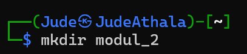
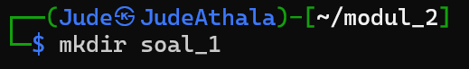
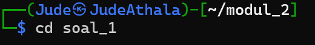
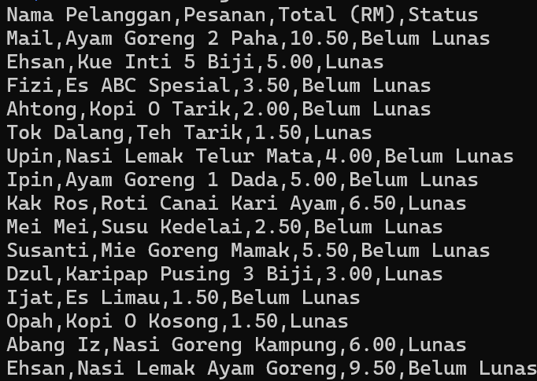
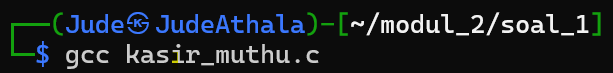
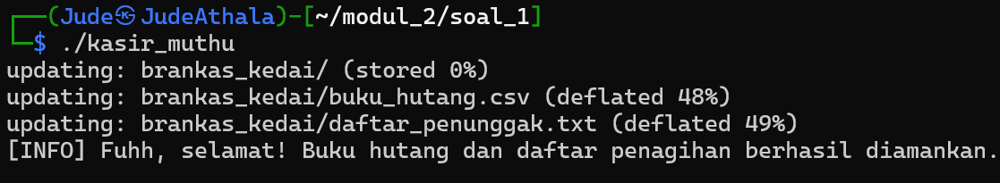
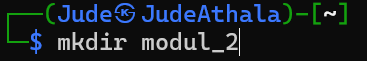
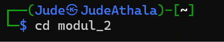
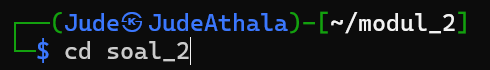
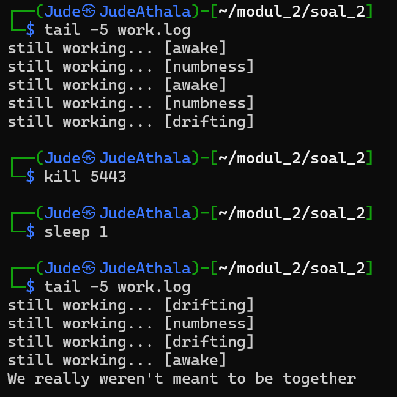

# Sisiop-2-2026-IT-098

## Profil Mahasiswa
Nama           : Jude Athala Yazid Sari

NRP            : 5027251098

Departemen     : Teknologi Informasi

Kelas          : Sistem Operasi A
 

## **Laporan Penyelesaian Soal Praktikum Modul 2**
Repository ini berisi *source code* dan penjelasan mengenai penyelesaian soal Praktikum Modul 2 untuk mata kuliah Sistem Operasi. Modul ini berfokus pada *proces & daemon* pada sistem operasi.

### Problem Keseluruhan
Pada penyelesaian Soal Modul 2 ini saya juga menggunakan bantuan Claude Ai karena di peraturan diperbolehkan menggunakan Ai. Disini saya menggunakan claude Ai untuk membuat script, menjelaskan alur dan memecahkan masalah pada penyelesaian soal Modul 2. Berikut link percakapan saya dengan Claude Ai
[Claude AI](https://claude.ai/share/5e612c0c-7d49-41bf-bd8e-2be75d92981d)

# Soal 1

## Deskripsi soal

Pada soal ini diceritakan bahwa komputer kasir milik Uncle Muthu terkena virus. Di dalamnya terdapat file buku_hutang.csv yang harus segera diamankan. Selain itu, diperlukan juga pemisahan data pelanggan dengan status "Belum Lunas" agar dapat ditindaklanjuti. `kasir_muthu.c` yang dapat melakukan serangkaian proses secara otomatis dan berurutan, mulai dari membuat folder penyimpanan, menyalin file, memproses data, hingga mengarsipkan hasilnya. Seluruh proses harus dijalankan menggunakan konsep sequential process dengan memanfaatkan `fork` , `exec`, dan `waitpid` tanpa menggunakan system.

## Penyelesaian soal 1

### Berikut langkah - langkah pengerjaan soal_1

#### langkah pertama

**inisiasi**

pertama-tama saat, karena saat mengerjakan sudah ada direktori soal_1, kita buat direktori modul_2 `mkdir modul_2` lalu masuk ke modul_2 `cd modul_2`. selanjutnya buat direktori soal_1 `mkdir soal_1`, lalu masuk soal_1 `cd soal_1`   






#### langkah kedua

mendownload spreadsheet yang sudah disediakan dengan cara `wget -O "url link"`


setelah itu cek apakah sudah benar dengan cara `cat buku_hutang.csv`




#### langkah ketiga

selanjutnya, saya membuat file script dengan nama kasir_muthu.c lalu diisi dengan kode script seperti dibawah ini.

`cat > kasir_muthu.c << 'EOF'
"script dari kasir_muthu.c"
'EOF'`

```awk

cat > kasir_muthu.c << 'EOF'

#include <stdio.h>
#include <stdlib.h>
#include <unistd.h>
#include <sys/wait.h>

#define ERROR_MSG "[ERROR] Aiyaa! Proses gagal, file atau folder tidak ditemukan.\n"
#define SUCCESS_MSG "[INFO] Fuhh, selamat! Buku hutang dan daftar penagihan berhasil diamankan.\n"

void run_child(char *argv[]) {
    pid_t pid = fork();
    if (pid < 0) {
        perror("fork failed");
        exit(EXIT_FAILURE);
    }
    if (pid == 0) {
        execvp(argv[0], argv);
        perror("exec failed");
        exit(EXIT_FAILURE);
    } else {
        int status;
        waitpid(pid, &status, 0);
        if (!WIFEXITED(status) || WEXITSTATUS(status) != 0) {
            printf(ERROR_MSG);
            exit(EXIT_FAILURE);
        }
    }
}

void run_shell_child(const char *cmd) {
    pid_t pid = fork();
    if (pid < 0) {
        perror("fork failed");
        exit(EXIT_FAILURE);
    }
    if (pid == 0) {
        char *argv[] = {"bash", "-c", (char *)cmd, NULL};
        execvp("bash", argv);
        perror("exec failed");
        exit(EXIT_FAILURE);
    } else {
        int status;
        waitpid(pid, &status, 0);
        if (!WIFEXITED(status) || WEXITSTATUS(status) != 0) {
            printf(ERROR_MSG);
            exit(EXIT_FAILURE);
        }
    }
}

int main() {
    char *mkdir_args[] = {"mkdir", "-p", "brankas_kedai", NULL};
    run_child(mkdir_args);

    char *cp_args[] = {"cp", "buku_hutang.csv", "brankas_kedai/", NULL};
    run_child(cp_args);

    const char *grep_cmd = "grep \"Belum Lunas\" brankas_kedai/buku_hutang.csv > brankas_kedai/daftar_penunggak.txt";
    run_shell_child(grep_cmd);

    char *zip_args[] = {"zip", "-r", "rahasia_muthu.zip", "brankas_kedai/", NULL};
    run_child(zip_args);

    printf(SUCCESS_MSG);
    return 0;
'EOF'
}

```

#### langkah keempat

selanjutnya, download zip dengan perintah `sudo apt install zip -y`


#### langkah kelima

compile zip dengan cara `gcc kasir_muthu.c



#### langkah keenam 

jalankan dengan cara `./kasir_muthu`


## Hasil Output



## Problem saat pengerjaan

Pada saat pengerjaan soal_1 modul 2 ini sempat kebingungan karena ada output `503 service unavailable` saat proses install `gcc` dan `zip` tetapi lupa untuk didokumentasikan karena pada saat ingin back scroll keatas di terminal ke atas, terminal nya ngelag jadi harus di clear, saat dicoba menggunakan wifi my-its terjadi  `503 service unavailable` tetapi jika menggunakan hotspot pribadi aman aman saja.

#### perintah perintah yang ada di soal_1

`cd` digunakan untuk berpindah direktori. command `cd` dipakai untuk masuk ke folder soal_1 ataupun folder yang sesuai dengan yang diinginkan agar seluruh proses dikerjakan di lokasi yang sesuai.

`wget -O` digunakan untuk mengunduh file dari internet. File buku_hutang.csv diambil dari link yang sudah disediakan untuk kemudian digunakan dalam proses selanjutnya.

`ls` digunakan untuk melihat daftar file dan folder yang ada di dalam direktori.

`cat` berfungsi untuk menampilkan isi file ke terminal. Digunakan untuk memastikan isi buku_hutang.csv sudah benar, serta untuk melihat hasil dari file daftar_penunggak.txt.

`gcc` digunakan untuk melakukan kompilasi program C. File kasir_muthu.c diubah menjadi file "executable" agar bisa dijalankan.

`./` ditujukan untuk menjalankan file "executable" hasil kompilasi, yaitu program kasir_muthu.

`mkdir` digunakan untuk membuat direktori baru. Dalam program, perintah ini dipakai untuk membuat folder brankas_kedai.

`cp` digunakan untuk menyalin file dari satu lokasi ke lokasi lain. File buku_hutang.csv disalin ke dalam folder brankas_kedai.

`grep` digunakan untuk mencari teks tertentu di dalam file. Digunakan untuk mengambil data dengan status “Belum Lunas” dari file CSV.

`zip` ini untuk mengompres file atau folder menjadi arsip. Folder brankas_kedai kemudian dikompres menjadi file rahasia_muthu.zip.

# Soal 2

## Deskripsi soal

Pada soal 2 ini, soal meminta membuat program daemon yang berjalan di background. Program akan membuat file contract.txt, menjaga agar file tersebut tetap ada dan tidak berubah, serta menuliskan aktivitas ke work.log secara berkala. Jika file dihapus atau diubah, program akan otomatis mengembalikannya seperti semula. Pengerjaannya menggunakan bahasa C dengan konsep daemon seperti `fork` , `setsid`, dan `signal`.

## Penyelesaian soal_2

### Berikut langkah - langkah pengerjaan soal_2

#### langkah pertama

pertama-tama, kita keluar dari soal_1 lalu buat soal_2, `mkdir soal_2` lalu kita buat direktori soal_2 `mkdir soal_2`, lalu masuk soal_2 `cd soal_1` 









#### langkah kedua

selanjutnya, saya menggunakan `cat` lalu membuat file script dengan nama contract_daemon.c yang berisi kode script dibawah ini.

```awk
#include <stdio.h>
#include <stdlib.h>
#include <string.h>
#include <unistd.h>
#include <signal.h>
#include <time.h>
#include <sys/stat.h>
#include <sys/types.h>
// Library standar yang dibutuhkan untuk I/O, proses, sinyal, dan waktu


#define CONTRACT_FILE "contract.txt"
#define WORK_LOG      "work.log"
// Nama file kontrak dan log yang digunakan daemon


// Ambil timestamp saat ini dan simpan ke buffer sebagai string
void get_timestamp(char *buf, size_t size) {
    time_t now = time(NULL);
    struct tm *t = localtime(&now);
    strftime(buf, size, "%Y-%m-%d %H:%M:%S", t);
}

// Tulis satu baris pesan ke file log (mode append)
void write_log(const char *msg) {
    FILE *f = fopen(WORK_LOG, "a");
    if (!f) return;
    fprintf(f, "%s\n", msg);
    fclose(f);
}

// Buat atau pulihkan file kontrak, isi dengan timestamp pembuatan/pemulihan
void create_contract(int restored) {
    char ts[64];
    get_timestamp(ts, sizeof(ts));
    FILE *f = fopen(CONTRACT_FILE, "w");
    if (!f) return;
    fprintf(f, "A promise to keep going, even when unseen.\n");
    if (restored)
        fprintf(f, "restored at: %s\n", ts);
    else
        fprintf(f, "created at: %s\n", ts);
    fclose(f);
}

// Cek apakah baris pertama kontrak masih sesuai ekspektasi
// Return: 1 = utuh, 0 = diubah/rusak, -1 = file hilang
const char *EXPECTED_LINE1 = "A promise to keep going, even when unseen.\n";

int contract_is_intact() {
    FILE *f = fopen(CONTRACT_FILE, "r");
    if (!f) return -1;
    char line1[256];
    if (!fgets(line1, sizeof(line1), f)) { fclose(f); return 0; }
    fclose(f);
    return strcmp(line1, EXPECTED_LINE1) == 0;
}

volatile sig_atomic_t keep_running = 1;

// Tangkap sinyal SIGTERM/SIGINT dan hentikan loop utama dengan aman
void handle_sigterm(int sig) {
    (void)sig;
    keep_running = 0;
}

// Ubah proses menjadi daemon: double fork + lepas dari terminal + tutup I/O
void daemonize() {
    pid_t pid = fork();
    if (pid < 0) exit(EXIT_FAILURE);
    if (pid > 0) exit(EXIT_SUCCESS);
    if (setsid() < 0) exit(EXIT_FAILURE);
    pid = fork();
    if (pid < 0) exit(EXIT_FAILURE);
    if (pid > 0) exit(EXIT_SUCCESS);
    freopen("/dev/null", "r", stdin);
    freopen("/dev/null", "w", stdout);
    freopen("/dev/null", "w", stderr);
}


int main() {
    daemonize();
    // Daftarkan signal handler dan buat kontrak awal saat daemon mulai
    signal(SIGTERM, handle_sigterm);
    signal(SIGINT,  handle_sigterm);
    create_contract(0);
    const char *statuses[] = {"[awake]", "[drifting]", "[numbness]"};
    srand((unsigned int)time(NULL));
    time_t last_log = time(NULL) - 5;
    while (keep_running) {
    // Pantau kontrak setiap detik — pulihkan jika hilang atau diubah
        int intact = contract_is_intact();
        if (intact == -1) {
            create_contract(1);
        } else if (intact == 0) {
            write_log("contract violated.");
            create_contract(1);
        }
    // Catat status kerja ke log setiap 5 detik dengan status acak
        time_t now = time(NULL);
        if (now - last_log >= 5) {
            const char *status = statuses[rand() % 3];
            char msg[64];
            snprintf(msg, sizeof(msg), "still working... %s", status);
            write_log(msg);
            last_log = now;
        }
        sleep(1);
    }
    // Tulis pesan terakhir ke log saat daemon berhenti
    write_log("We really weren't meant to be together");
    return 0;
}
```

#### langkah ketiga

`ls -lh contract_daemon.c` digunakan untuk untuk memastikan bahwa file program sudah berhasil dibuat


#### langkah keempat

compile terlebih dahulu `gcc -o contract_daemon contract_daemon.c`


#### langkah langkah kelima

Cek contract.txt dengan cara

cat contract.txt

Output yang diharapkan:

A promise to keep going, even when unseen.
created at: 2026-04-07 18:46:00

## Hasil Output



#### langkah langkah keenam

Cek PID untuk nanti di kill

ps aux | grep contract_daemon | grep -v grep


#### langkah langkah ketujuh

rm contract.txt

bashsleep 2

bashcat contract.txt

Output yang diharapkan:

A promise to keep going, even when unseen.
restored at: 2026-04-07 18:xx:xx

#### langkah langkah kedelapan

ubah isi contract.txt dengan cara `echo "hacked!" > contract.txt`

bashsleep 2

bashcat work.log

bashcat contract.txt

Output yang diharapkan di work.log ada baris:

contract violated.

Dan contract.txt sudah kembali:
A promise to keep going, even when unseen.
restored at: 2026-04-07 18:xx:xx

## Problem saat pengerjaan

saat pengerjaan ada kendala dibagian output, karena output yang diminta masih salah karena lupa untuk kill PID yang harus dikill terlebih dahulu.

